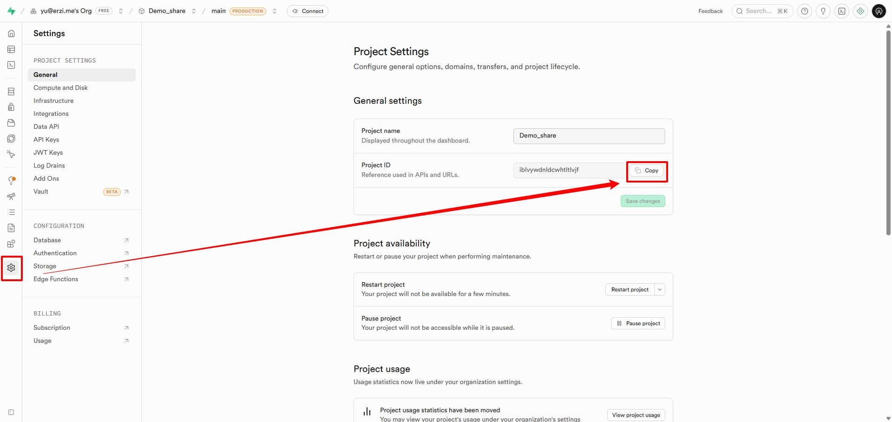
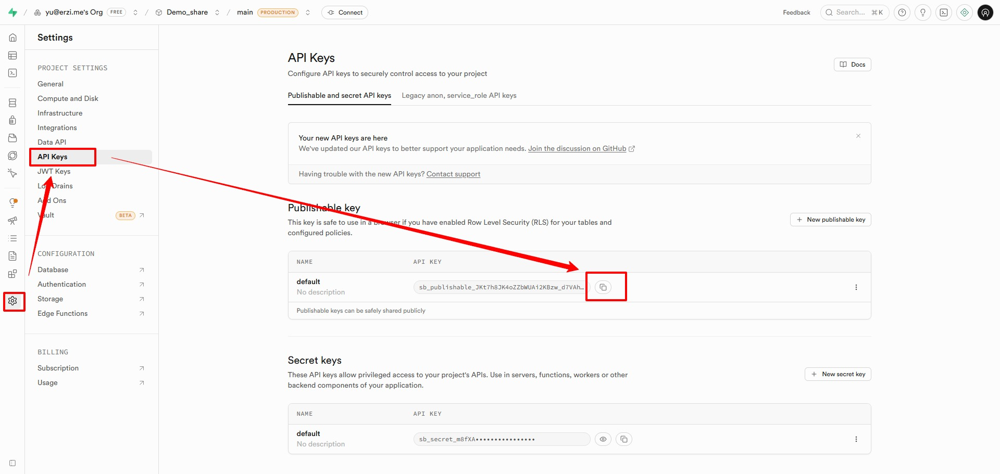

# 快速开始

## 前置准备

<Links
  :grid="3"
  :items="[
    {
      image: {
        light: 'https://i.theojs.cn/logo/github.svg',
        dark: 'https://i.theojs.cn/logo/github-dark.svg',
        crop: true
      },
      name: '阿里云',
      desc: '推荐【阿里云】作为点位图片存储方案。',
      link: 'https://oss.console.aliyun.com/bucket'      
    },
    {
      image: {
        light: 'https://i.theojs.cn/logo/github.svg',
        dark: 'https://i.theojs.cn/logo/github-dark.svg',
        crop: true
      },
      name: 'Supabase',
      desc: '作为后端数据存储使用，如：点位数据、平台用户。',
      link: 'https://supabase.com/'
    },
    {
      image: {
        light: 'https://i.theojs.cn/logo/github.svg',
        dark: 'https://i.theojs.cn/logo/github-dark.svg',
        crop: true
      },
      name: 'Piclist',
      desc: '当你有自己的图床时，可以使用这个软件配合本项目使用。',
      link: 'https://piclist.cn/'
    },
    {
      image: {
        light: 'https://i.theojs.cn/logo/github.svg',
        dark: 'https://i.theojs.cn/logo/github-dark.svg',
        crop: true
      },
      name: 'NodeJS',
      desc: '版本 >= 18',
      link: 'https://piclist.cn/'
    },
    {
      image: {
        light: 'https://i.theojs.cn/logo/github.svg',
        dark: 'https://i.theojs.cn/logo/github-dark.svg',
        crop: true
      },
      name: 'npm',
      desc: '无版本要求',
      link: 'https://piclist.cn/'
    }
  ]"
/>

### 配置图床

[点我跳转-图床配置](image-hosting.md)

### supabase建表

[点我跳转-数据库建表](base-hosting.md)

## 安装步骤

### 1. 克隆项目

```bash
git clone https://github.com/your-username/valpoint.git
cd valpoint
```

### 2. 安装依赖

```bash
npm install
# 或
pnpm install
```

### 3. 配置环境变量

复制 `.env.example` 为 `.env`，填入你的配置，主要是替换 `# Supabase 主库配置` 中的数据。

其中 `# Supabase 共享库配置` 为我做的一个分享库，只要你们填写了这个分享库的配置，就能从分享库中获取其他人分享的点位数据，当然，你也可以自建分享库，详见[supabase建表](#supabase建表)

```env
# Supabase 主库配置
VITE_SUPABASE_URL=https://[PROJECT_ID].supabase.co
VITE_SUPABASE_ANON_KEY=[YOUR_ANON_KEY]

# Supabase 共享库配置
VITE_SUPABASE_SHARE_URL=https://dhkmniuzmifvuozbhfhg.supabase.co
VITE_SUPABASE_SHARE_ANON_KEY=sb_publishable_3UBYzGE1w5z3cSb5cMfM1Q_ilKneWlM
```

复制的 `Project ID` 替换掉 `[PROJECT_ID]` ，如： `https://iblvywdnldcwhtltlvjf.supabase.co` ,参开下面的 `# Supabase 共享库配置` 样式进行填写
<figure class="full-bleed">
  
  <figcaption>VITE_SUPABASE_URL</figcaption>
</figure>

<figure class="full-bleed">
  
  <figcaption>VITE_SUPABASE_ANON_KEY</figcaption>
</figure>


### 4. 启动开发服务器

```bash
npm run dev
```

### 5. 访问应用

打开浏览器访问：`http://localhost:3208`

## 首次使用

### 游客模式

无需登录即可：
- 查看共享库中的点位
- 分享点位（生成短链接）
- 浏览地图标注

### 登录模式

登录后可以：
- 新增、编辑、删除个人点位
- 分享点位到共享库
- 从共享库复制点位到个人库
- 配置图床上传图片

## 下一步

- [个人点位库](/guide/personal-library) - 学习如何管理你的点位
- [作者信息获取](/guide/author-info) - 了解如何自动获取视频作者信息
- [图床配置](/guide/image-hosting) - 配置图床上传图片
