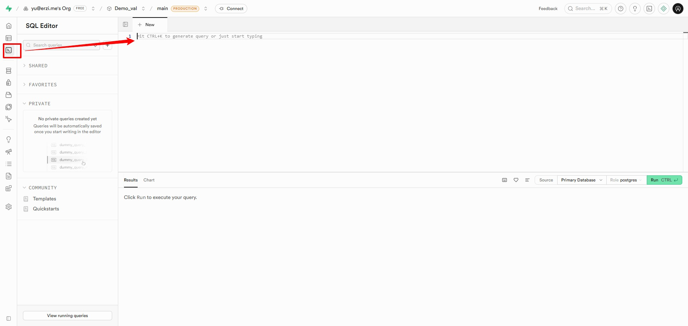
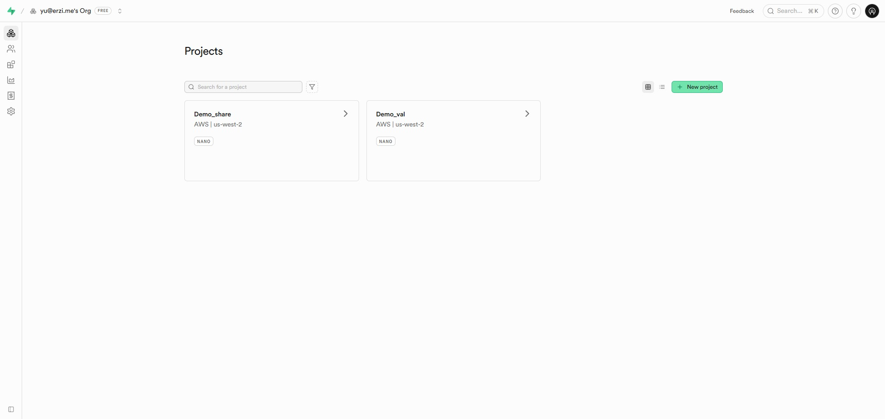
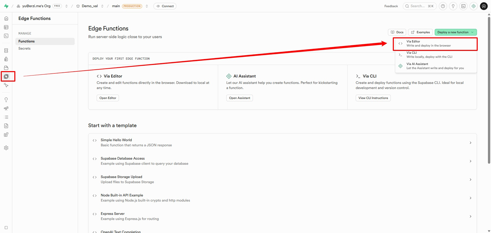
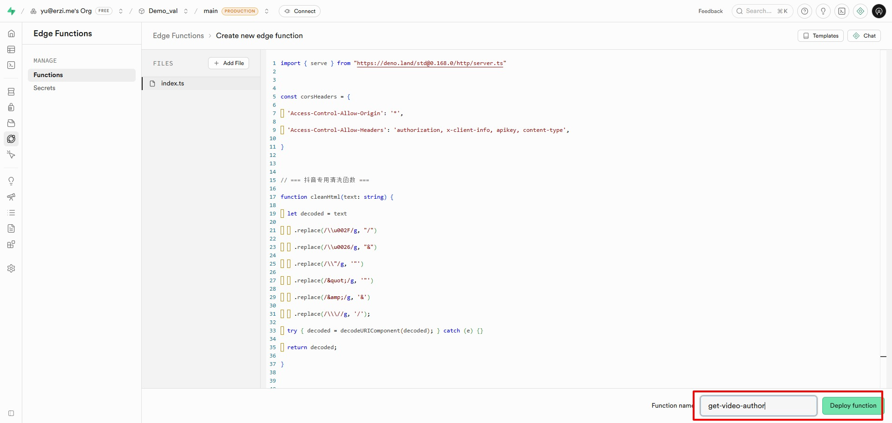
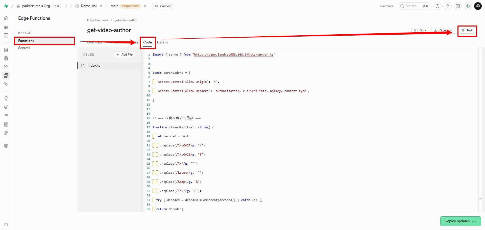
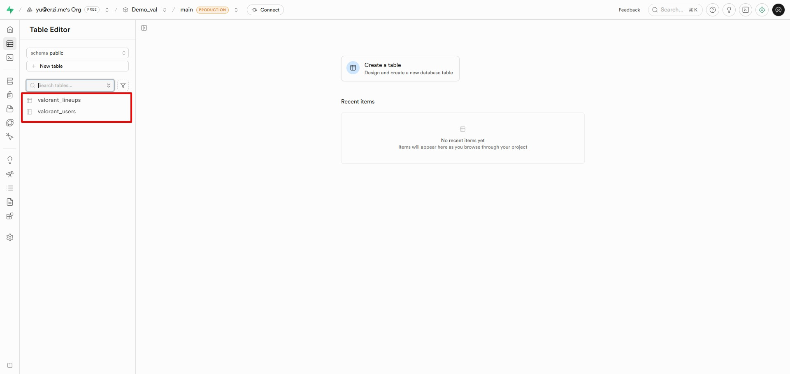
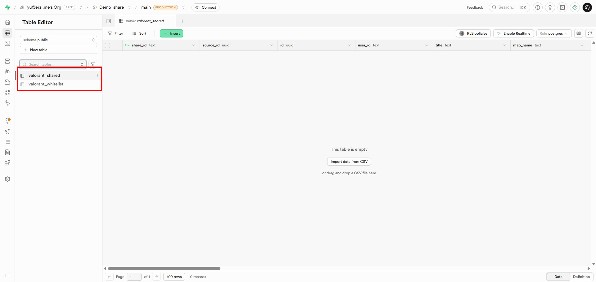

# 数据库建表
## SupaBase - Table Editor
以下所有代码，都在 `SupaBase` 的 `SQL Editor` 处执行，下方点击 `details Click me to view the code` 查看代码。

<figure class="full-bleed">
  
  <figcaption>supabase编辑页</figcaption>
</figure>

### 一点建议

建议新增两个项目，一个存放点位、用户、白名单，如： `Demo_val` ；另一个项目存放分享库的点位，如： `Demo_share` ；因为分享库的 `KEY` 是要分享出去，大家才能到你这里分享分享点位，所以就会存在泄漏 `KEY` 的风险，如果将它独立起来，就不用怕存在什么数据问题了，当然，如果你是自己使用，那就无所谓了。


<figure class="full-bleed">
  
  <figcaption>免费版只能新建两个项目</figcaption>
</figure>

## 📊 核心业务表

> [!TIP]
> 代码说明： **valorant_lineups** 数据表存放的是点位数据， **valorant_users** 数据表存放的是用户ID数据。
>
> 如果你希望你自己的数据持久化，那么一定要新增自己的数据表，<b>因为我不能保证我的演示网站能运行多久，而且我的共享库设置了定时清理任务，超过15天的分享点位，将会被清理</b>，所以如果在共享库遇到自己喜欢的点位，请尽快保存到自己的个人库中。

::: details Click me to view the code

``` sql
-- 0) 基础扩展 (必须，用于 gen_random_uuid)
create extension if not exists pgcrypto;

--------------------------------------------------------------------------------
-- 1) 核心表结构
--------------------------------------------------------------------------------

-- Table: valorant_lineups
create table if not exists public.valorant_lineups (
  id              uuid primary key default gen_random_uuid(),
  user_id         text not null,
  title           text not null,
  map_name        text not null,
  agent_name      text not null,
  agent_icon      text,
  skill_icon      text,
  side            text not null default 'attack', -- attack / defense
  ability_index   int,
  agent_pos       jsonb,
  skill_pos       jsonb,
  stand_img       text,
  stand_desc      text,
  stand2_img      text,
  stand2_desc     text,
  aim_img         text,
  aim_desc        text,
  aim2_img        text,
  aim2_desc       text,
  land_img        text,
  land_desc       text,
  source_link     text,
  cloned_from     text,
  -- 作者信息字段
  author_name     text,
  author_avatar   text,
  author_uid      text,
  -- 时间戳
  created_at      timestamptz not null default now(),
  updated_at      timestamptz not null default now()
);

-- Table: valorant_users
create table if not exists public.valorant_users (
  user_id    text primary key,
  password   text,
  created_at timestamptz not null default now(),
  updated_at timestamptz not null default now()
);

--------------------------------------------------------------------------------
-- 2) 索引
--------------------------------------------------------------------------------
create index if not exists idx_lineups_user_created_at 
  on public.valorant_lineups (user_id, created_at desc);

--------------------------------------------------------------------------------
-- 3) RLS 策略
--------------------------------------------------------------------------------

-- lineups
alter table if exists public.valorant_lineups enable row level security;

create policy "anon select lineups" 
  on public.valorant_lineups for select using (auth.role() = 'anon');

create policy "anon insert lineups" 
  on public.valorant_lineups for insert with check (auth.role() = 'anon');

create policy "anon update lineups" 
  on public.valorant_lineups for update using (auth.role() = 'anon');

create policy "anon delete lineups" 
  on public.valorant_lineups for delete using (auth.role() = 'anon');

-- users
alter table if exists public.valorant_users enable row level security;

create policy "anon select users" 
  on public.valorant_users for select using (auth.role() = 'anon');

create policy "anon upsert users" 
  on public.valorant_users for insert with check (auth.role() = 'anon');

create policy "anon update users" 
  on public.valorant_users for update using (auth.role() = 'anon');
```
:::

## 🧩 共享功能表

建议另起一个项目存放该表，详见[一点建议](#一点建议)

> [!TIP]
> 代码说明： **valorant_shared** 数据表存放的是共享库数据
>
> 如果自己不想搭建共享库，可以不用看这一步

::: details Click me to view the code

``` sql
-- 0) 基础扩展 (防止单独执行此文件时报错)
create extension if not exists pgcrypto;

--------------------------------------------------------------------------------
-- 1) 共享表结构
--------------------------------------------------------------------------------

-- Table: valorant_shared
create table if not exists public.valorant_shared (
  share_id        text primary key,
  source_id       uuid, -- 逻辑上关联 lineups.id，但此处做软关联
  id              uuid default gen_random_uuid(),
  user_id         text,
  title           text not null,
  map_name        text not null,
  agent_name      text not null,
  agent_icon      text,
  skill_icon      text,
  side            text not null default 'attack',
  ability_index   int,
  agent_pos       jsonb,
  skill_pos       jsonb,
  stand_img       text,
  stand_desc      text,
  stand2_img      text,
  stand2_desc     text,
  aim_img         text,
  aim_desc        text,
  aim2_img        text,
  aim2_desc       text,
  land_img        text,
  land_desc       text,
  source_link     text,
  cloned_from     text,
  created_at      timestamptz not null default now(),
  updated_at      timestamptz not null default now()
);

--------------------------------------------------------------------------------
-- 2) 索引
--------------------------------------------------------------------------------
create index if not exists idx_shared_source 
  on public.valorant_shared (source_id);

--------------------------------------------------------------------------------
-- 3) RLS 策略
--------------------------------------------------------------------------------

alter table if exists public.valorant_shared enable row level security;

create policy "anon select shared" 
  on public.valorant_shared for select using (auth.role() = 'anon');

create policy "anon insert shared" 
  on public.valorant_shared for insert with check (auth.role() = 'anon');

create policy "anon update shared" 
  on public.valorant_shared for update using (auth.role() = 'anon');

create policy "anon delete shared" 
  on public.valorant_shared for delete using (auth.role() = 'anon');
```
:::

### 定时清理任务

这个表，是要在 ` valorant_shared` 所在的项目操作的。

> [!TIP]
> 同理，如果你没有搭建共享库，那么也无需设置定时任务

::: details Click me to view the code

``` sql
-- 0) 开启定时任务扩展 (必须安装 pg_cron)
create extension if not exists pg_cron with schema extensions;

--------------------------------------------------------------------------------
-- 1) 白名单表 (改为存储 user_id)
--------------------------------------------------------------------------------
create table if not exists public.valorant_whitelist (
  user_id     text primary key,      -- 核心变动：这里存的是 user_id
  note        text,                  -- 备注，例如："管理员"、"VIP用户"
  created_at  timestamptz default now()
);

-- (可选) 开启 RLS
alter table public.valorant_whitelist enable row level security;

--------------------------------------------------------------------------------
-- 2) 清理函数
--------------------------------------------------------------------------------
create or replace function public.cleanup_expired_shares()
returns void
language plpgsql
security definer
set search_path = public
as $$
begin
  -- 删除逻辑：
  -- 1. 创建时间早于 15 天前
  -- 2. 且 (该记录的 user_id 不在白名单表中 OR user_id 为空)
  
  delete from public.valorant_shared s
  where s.created_at < now() - interval '15 days'
  and not exists (
      select 1 
      from public.valorant_whitelist w 
      where w.user_id = s.user_id
  );
  
  -- 解释：
  -- 如果 s.user_id 在白名单里，EXISTS 为真，NOT EXISTS 为假 -> 不删除 (保留)
  -- 如果 s.user_id 不在白名单里，EXISTS 为假，NOT EXISTS 为真 -> 删除
  -- 如果 s.user_id 为 NULL (匿名分享)，NULL = w.user_id 永远不成立，EXISTS 为假，NOT EXISTS 为真 -> 删除
end;
$$;

--------------------------------------------------------------------------------
-- 3) 注册定时任务 (每天凌晨 03:00 执行)
--------------------------------------------------------------------------------

-- 先尝试移除同名任务（存在才删，避免报错）
DO $$
DECLARE jid int;
BEGIN
  SELECT jobid INTO jid
  FROM cron.job
  WHERE jobname = 'valorant-cleanup-daily';

  IF jid IS NOT NULL THEN
    PERFORM cron.unschedule(jid);
  END IF;
END $$;

-- 创建新任务
select cron.schedule(
  'valorant-cleanup-daily',   
  '0 3 * * *',                
  'select public.cleanup_expired_shares()'
);
```
:::

### 查看定时任务
``` sql
select * from cron.job;
```

### 删除定时任务

`SELECT cron.unschedule(1);` 中的 `1` 是 `jobid` ，运行查看定时任务，可以看得到。

``` sql
-- 1. 先确认这个任务是否存在
SELECT jobid, jobname
FROM cron.job
WHERE jobname = 'valorant-cleanup-daily';
-- 2. 删除定时任务
SELECT cron.unschedule(1);

```

### 立即执行一次清理任务
``` sql
select public.cleanup_expired_shares();
```

### 定时任务添加白名单

``` sql
insert into public.valorant_whitelist (user_id, note)
values ('user_12345_abcde', '特权用户，永久保留数据')
on conflict (user_id) do nothing;
```

其中 `user_12345_abcde` 换成你自己的ID

## SupaBase - Edge Functions
在你存放 **点位表** 的项目中新增，如： `Demo_val`  ，点击 `Deploy a new function` 新增，并在下面填入 `get-video-author` 标题

> [!TIP]
> 代码说明： **get-video-author** 是用来获取点位视频博主的头像+用户名信息

::: details Click me to view the code

``` sql
import { serve } from "https://deno.land/std@0.168.0/http/server.ts"

  

const corsHeaders = {

  'Access-Control-Allow-Origin': '*',

  'Access-Control-Allow-Headers': 'authorization, x-client-info, apikey, content-type',

}

  

// === 抖音专用清洗函数 ===

function cleanHtml(text: string) {

  let decoded = text

    .replace(/\\u002F/g, "/")

    .replace(/\\u0026/g, "&")

    .replace(/\\"/g, '"')

    .replace(/&quot;/g, '"')

    .replace(/&amp;/g, '&')

    .replace(/\\\//g, '/');

  try { decoded = decodeURIComponent(decoded); } catch (e) {}

  return decoded;

}

  

// === Bilibili 解析核心 (API 模式) ===

async function handleBilibili(targetUrl: string) {

    console.log("正在解析 Bilibili:", targetUrl)

  

    // 1. 提取 BV 号

    // B站视频 ID 通常是 BV 开头的 10-12 位字符

    const bvMatch = targetUrl.match(/(BV[a-zA-Z0-9]+)/)

    if (!bvMatch) {

        throw new Error("未找到有效的 BV 号")

    }

    const bvid = bvMatch[1]

    console.log("提取到 BVID:", bvid)

  

    // 2. 直接调用 B 站官方 API

    // 这是一个公开接口，通常不需要复杂的 Cookie 就能访问

    const apiUrl = `https://api.bilibili.com/x/web-interface/view?bvid=${bvid}`

    // 即使是 API，也需要伪装一下 UA

    const headers = {

        "User-Agent": "Mozilla/5.0 (Windows NT 10.0; Win64; x64) AppleWebKit/537.36 (KHTML, like Gecko) Chrome/120.0.0.0 Safari/537.36",

        "Referer": "https://www.bilibili.com/"

    }

  

    const response = await fetch(apiUrl, { headers })

    const json = await response.json()

  

    // 3. 解析 API 返回的 JSON

    // 成功代码是 0

    if (json.code === 0 && json.data) {

        const data = json.data

        const owner = data.owner

        return {

            username: owner.name,

            avatar: owner.face, // B站 API 返回的头像通常是 http 或 https

            user_home_url: `https://space.bilibili.com/${owner.mid}`,

            is_cover: false,

            source: "bilibili",

            // 额外福利：B站封面图

            cover_image: data.pic

        }

    } else {

        throw new Error(`B站 API 报错: code=${json.code}, message=${json.message}`)

    }

}

  

// === 抖音 解析核心 (保持 V17 最稳版本) ===

async function handleDouyin(targetUrl: string) {

    console.log("正在解析 抖音:", targetUrl)

    const headers = {

        "User-Agent": "Mozilla/5.0 (iPad; CPU OS 13_3 like Mac OS X) AppleWebKit/605.1.15 (KHTML, like Gecko) CriOS/87.0.4280.77 Mobile/15E148 Safari/604.1",

        "Referer": "https://www.douyin.com/"

    }

  

    const response = await fetch(targetUrl, { headers })

    const rawHtml = await response.text()

    const html = cleanHtml(rawHtml)

  

    let nickname = "", avatar = "", sec_uid = ""

  

    // 1. 提取主页 (iPad href 策略)

    const linkRegex = /href=["']\/\/www\.douyin\.com\/user\/(MS4wLjABAAAA[A-Za-z0-9_\\-]+)["']/

    const linkMatch = html.match(linkRegex)

    if (linkMatch) sec_uid = linkMatch[1]

    if (!sec_uid) {

        const routeMatch = html.match(/\/user\/(MS4wLjABAAAA[A-Za-z0-9_\\-]+)/)

        if (routeMatch) sec_uid = routeMatch[1]

    }

    if (!sec_uid) {

        const authorBlock = html.match(/"author"\s*:\s*\{[\s\S]*?"sec_uid"\s*:\s*"(MS4wLjABAAAA[A-Za-z0-9_\\-]+)"/)

        if (authorBlock) sec_uid = authorBlock[1]

    }

  

    const userHomeUrl = sec_uid ? `https://www.douyin.com/user/${sec_uid}` : ""

  

    // 2. 提取头像

    const avatarMatch = html.match(/"url_list":\["(https:\/\/[^"]*?aweme-avatar[^"]*?)"/)

    if (avatarMatch) avatar = avatarMatch[1]

  

    if (!avatar) {

        const jsonMatch = html.match(/"avatar_(larger|medium|thumb)":\{"uri":"[^"]*","url_list":\["(https:\/\/[^"]+)"/)

        if (jsonMatch) avatar = jsonMatch[2]

    }

    if (!avatar) {

        const manualMatch = html.match(/(https:\/\/[^"']*?100x100\/aweme-avatar[^"']*)/)

        if (manualMatch) avatar = manualMatch[1]

    }

  

    let isCover = false

    if (!avatar) {

        const coverMatch = html.match(/]+src=["'](https:\/\/[^"']+)["']/)

        if (coverMatch) {

            avatar = coverMatch[1]; isCover = true

        }

    }

  

    // 3. 提取用户名

    if (avatar && !isCover) {

        const urlPart = avatar.split('?')[0].split('/').pop();

        if (urlPart && urlPart.length > 5) {

             const altRegex = new RegExp(`]*${urlPart}[^>]*alt=["']([^"']+)["']`)

             const altMatch = html.match(altRegex)

             if (altMatch) nickname = altMatch[1]

        }

    }

    if (!nickname) {

        const titleMatch = html.match(/<title>(.*?)[\s-]*抖音/)

        if (titleMatch) nickname = titleMatch[1].trim()

    }

    if (!nickname) {

        const jsonName = html.match(/"nickname"\s*:\s*"([^"]+)"/)

        if (jsonName) nickname = jsonName[1]

    }

  

    return {

        username: nickname || "未提取到",

        avatar: avatar || "",

        user_home_url: userHomeUrl,

        is_cover: isCover,

        source: "douyin"

    }

}

  

// === 主入口 ===

serve(async (req) => {

  if (req.method === 'OPTIONS') return new Response('ok', { headers: corsHeaders })

  

  try {

    const body = await req.json()

    const urlText = body.url || ""

    console.log("收到请求内容:", urlText.substring(0, 100))

  

    if (!urlText) throw new Error("缺少 URL 参数")

  

    // 1. 抖音正则 (包含 v.douyin 和 www.douyin)

    // [^\s"']+ 允许特殊字符链接

    const douyinRegex = /(https?:\/\/(?:v|www|www\.iesdouyin|m)\.douyin\.com\/[^\s"']+)/

    // 2. B站正则 (包含 b23.tv 和 bilibili.com)

    const biliRegex = /(https?:\/\/(?:www|m)\.bilibili\.com\/video\/[^\s"']+)|(https?:\/\/b23\.tv\/[^\s"']+)/

  

    let targetUrl = ""

    let platform = ""

  

    const matchDouyin = urlText.match(douyinRegex)

    const matchBili = urlText.match(biliRegex)

  

    if (matchDouyin) {

        targetUrl = matchDouyin[0]

        platform = "douyin"

    } else if (matchBili) {

        targetUrl = matchBili[0]

        platform = "bilibili"

    } else {

        throw new Error("无效链接：未识别到 抖音 或 B站 链接")

    }

  

    let result;

    if (platform === "douyin") {

        result = await handleDouyin(targetUrl)

    } else if (platform === "bilibili") {

        let finalUrl = targetUrl

        // 处理 b23.tv 短链重定向

        if (targetUrl.includes("b23.tv")) {

             console.log("解析 B站短链...")

             const r = await fetch(targetUrl, { redirect: 'follow' })

             finalUrl = r.url

             console.log("还原长链:", finalUrl)

        }

        result = await handleBilibili(finalUrl)

    }

  

    return new Response(

      JSON.stringify({ status: "success", data: result }),

      { headers: { ...corsHeaders, "Content-Type": "application/json" } }

    )

  

  } catch (error) {

    console.error("处理出错:", error.message)

    return new Response(JSON.stringify({ error: error.message }), { headers: { ...corsHeaders, "Content-Type": "application/json" }, status: 400 })

  }

})
```

:::

<figure class="full-bleed">
  
  <figcaption>步骤1</figcaption>
</figure>


<figure class="full-bleed">
  
  <figcaption>步骤2</figcaption>
</figure>

<figure class="full-bleed">
  
  <figcaption>步骤3</figcaption>
</figure>

<figure class="full-bleed">
  
  <figcaption>步骤4</figcaption>
</figure>

---

如果能得到以下的返回结果，就说明调试成功了
### B站测试数据

``` json
{ "url": "【这几年，电视画质为什么变差了...】 【精准空降到 02:26】 https://www.bilibili.com/video/BV1acmCBtEst/?share_source=copy_web&vd_source=fd59995bf2f70580369462145819da94&t=146" }
```

#### 返回结果

``` json
{
  "status": "success",
  "data": {
    "username": "影视飓风",
    "avatar": "https://i0.hdslb.com/bfs/face/c1733474892caa45952b2c09a89323157df7129a.jpg",
    "user_home_url": "https://space.bilibili.com/946974",
    "is_cover": false,
    "source": "bilibili",
    "cover_image": "http://i2.hdslb.com/bfs/archive/2ca10436a2d9343d6b03739dd9914edfef021a07.jpg"
  }
}
```

### 抖音测试数据

``` json
{ "url": "0.20 c@N.Ji 03/08 seb:/ 这几年，电视画质为什么变差了...# 电视 # 画质 # 电视设置 # 技术 # 体验  https://v.douyin.com/3HrmbOLNjZw/ 复制此链接，打开Dou音搜索，直接观看视频！" }
```

#### 返回结果

``` json
{
  "status": "success",
  "data": {
    "username": "影视飓风",
    "avatar": "https://p3.douyinpic.com/aweme/100x100/aweme-avatar/tos-cn-avt-0015_a8cf976fa76120a291a9aacb9c4439f8.jpeg?from=327834062",
    "user_home_url": "https://www.douyin.com/user/MS4wLjABAAAAaCcBHb3Rhc4zxF8YkBOfHfLh6k-IWEK2l3Ne9xOXPnQ",
    "is_cover": false,
    "source": "douyin"
  }
}
```


## 期望结果

<figure class="full-bleed">
  
  <figcaption>Demo_val库存在的两张表</figcaption>
</figure>


<figure class="full-bleed">
  
  <figcaption>Demo_share库存在的两张表</figcaption>
</figure>
